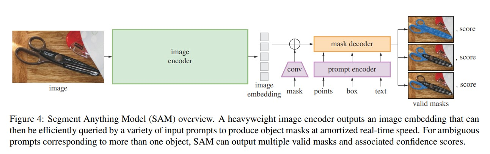

# Awesome coding programs
Read & Learn.

[TOC]

## Deep Learning
### segment-anything
A nice blog post reviewed SAM in Chinese: 
https://blog.csdn.net/qq_43426908/article/details/136284259?spm=1001.2014.3001.5502

A nice github repo collects existing works on SAM in Medical Images field: 
https://github.com/YichiZhang98/SAM4MIS



Project framework: 
```
segment_anything
    |-modeling
        |-__init__.py
        |-common.py
        |-image_encoder.py  
        |-mask_decoder.py 
        
        |-prompt_encoder.py 
        |-sam.py    # Sam(nn.module)
        |-transformer.py
    |-utils
        |-__init__.py
        |-amg.py
        |-onnx.py
        |-transforms.py
    |-__init__.py
    |-automatic_mask_generator.py
    |-build_sam.py  # parameter Interface
    |-predictor.py 

```


### Attention is All you need (Pytorch)
original: https://github.com/jadore801120/attention-is-all-you-need-pytorch.git

a blog to introduce common pre-process of nlp datasets (eg.wmt2016): https://lulaoshi.info/blog/NMT-dataset-preprocess/#%E8%AE%AD%E7%BB%83%E8%AF%AD%E6%96%99%E5%BA%93